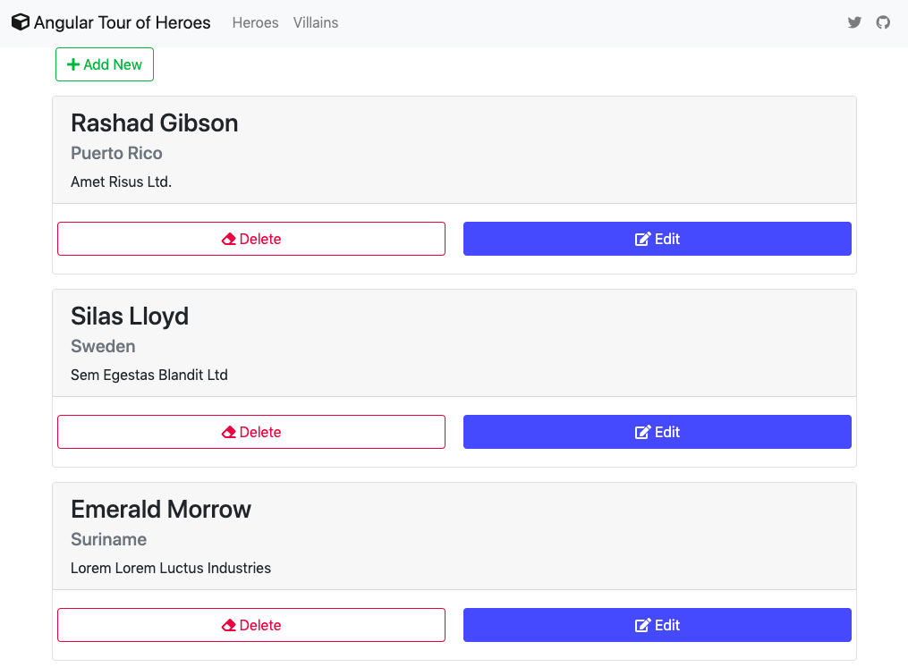

# My version of Tour of Heroes app using Angular and NGXS as the state management tool

### To run the project after cloning
Create or go to your demo directory then run the following in the terminal or cmd.
```sh
$ git clone https://github.com/webmasterdevlin/heroes-ngxs.git
$ cd heroes-ngxs
$ npm install
$ npm run start
```
The Angular app and the fake web service will run concurrently.



